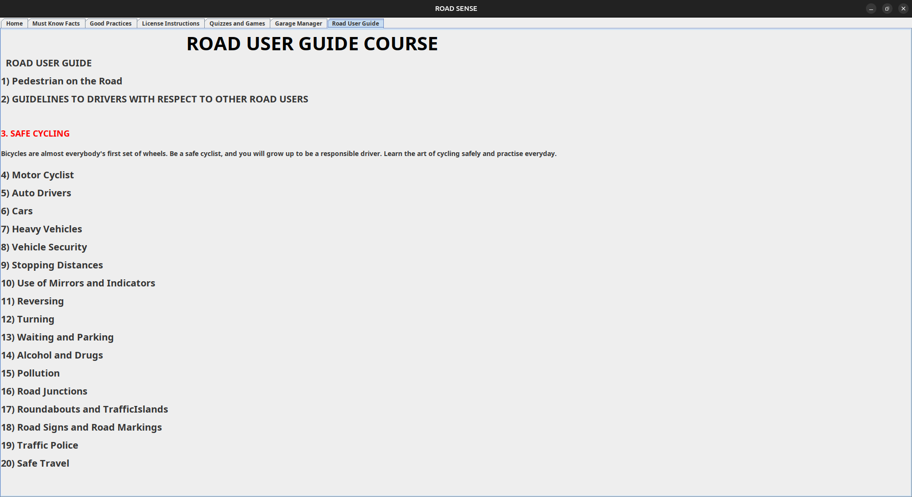
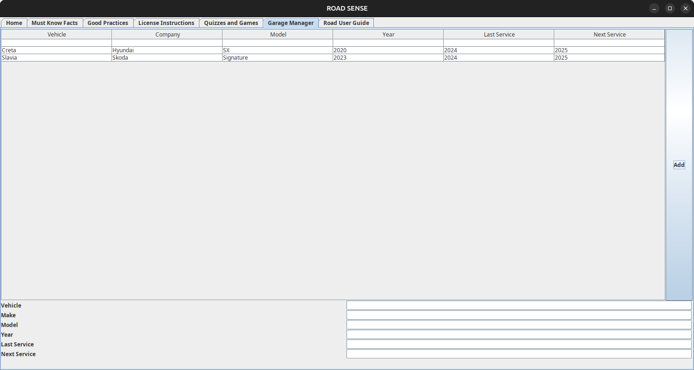
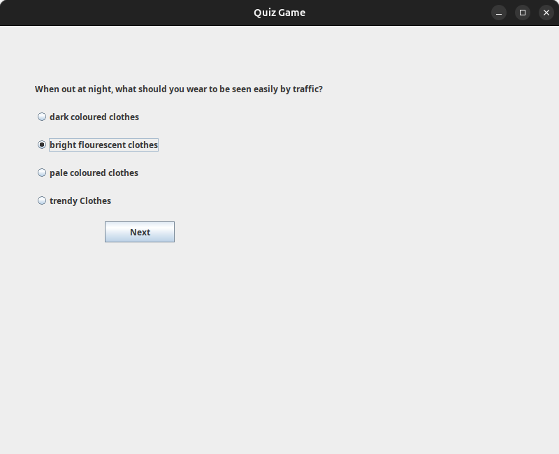
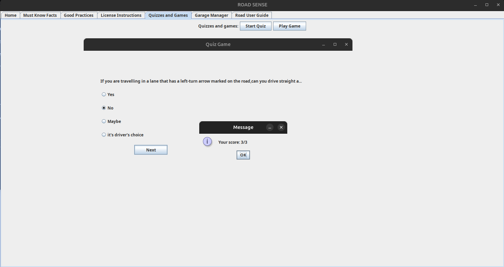

# Road Sense - One stop solution to learn driving

**Road Sense** is a Java-based educational application designed to enhance road safety awareness through interactive learning modules and quizzes. The project includes a **Quiz Game**, a **Driving School**, and a **Garage Manager** module to educate users about traffic rules, safe driving practices, and vehicle management.  

## Features  

- **Quiz Game** 📚: Test your knowledge of traffic rules with interactive multiple-choice quizzes.  
- **Driving School** 🚗: Learn essential road safety concepts and driving practices.  
- **Garage Manager** 🏍️🚘: Maintain a **virtual garage** where users can record and manage details of their owned vehicles, including model, registration number, and maintenance records.  
- **Graphical User Interface (GUI)** 🎨: Built using **Swing** for a user-friendly experience.  
- **Modular Codebase** 🏗️: Follows a structured package-based approach for better maintainability.  
- **Object-Oriented Design** 🛠️: Implements Java OOP principles.  

## Screenshots  

<p align="center">
    
    
</p>
<p align="center">
    
    
</p>


## Installation & Usage  

### Prerequisites  
- Java Development Kit (JDK) installed  
- A Java-compatible IDE or terminal  

### Clone the Repository  
```sh
git clone https://github.com/rajanraj2/Road_Sense.git
cd Road_Sense
```  

### Compile the Code  
```sh
javac src/net/codejava/*.java
```  

### Run the Application  
```sh
java src.net.codejava.DrivingSchool
```  

## Project Structure  
```
Road-Sense/
│── src/
│   ├── net/
│   │   ├── codejava/
│   │   │   ├── QuizGame.java
│   │   │   ├── DrivingSchool.java
│   │   │   ├── GarageManager.java
│── README.md
│── .gitignore
```  

## Contributing  
Contributions are welcome! Feel free to fork the repository, create feature branches, and submit pull requests.  

## License  
This project is licensed under the MIT License.  

---  
Made with ❤️ by Rajan Raj  

---
